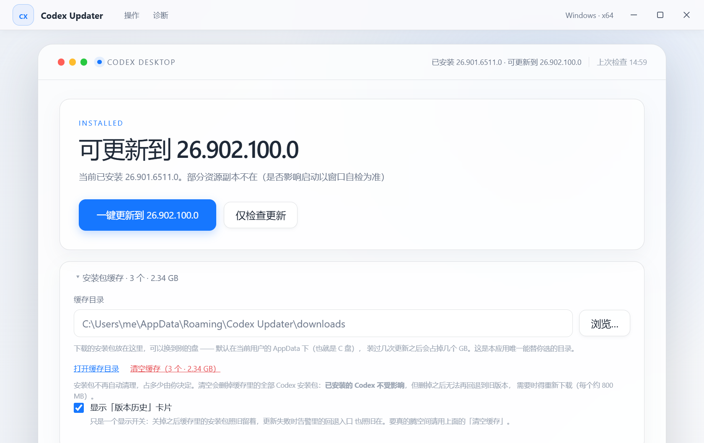

# Codex Updater

[](https://github.com/aygzs123/Codex-Auto-Update-Plugin-New/actions/workflows/ci.yml)
[](./LICENSE)
[English](README_EN.md) | [中文](README.md)

Keep the **Microsoft Store / MSIX build of Codex Desktop** up to date on Windows, and
deal with the potholes on the way: packages that need administrator rights, an update
that leaves no window behind, and wanting the previous version back.



## What this is

It solves one problem: **updating the Store build of Codex Desktop is awkward to
automate and awkward on a fresh machine.** When the Store's own update does not happen
there is no message, newer packages need an administrator context to install, and an
update can occasionally leave the app running with no window. This repository turns
all of that into one button that walks the whole chain and shows its evidence at every
step.

Three entry points — pick one:

| Entry point | What it is | Who it is for |
| --- | --- | --- |
| **Desktop app** | a single self-contained NSIS `.exe` | most users; new machines; anyone avoiding the command line; you want diagnostics and rollback |
| **Plugin + daily automation** | `install\install.ps1` | already using the Codex plugin system; you want an unattended daily check |
| **Web UI** | clone the repo, run `webui\start-webui.bat` | you already cloned the repo and want buttons plus live logs (needs Python 3) |

**They do not cooperate — one is enough.** The desktop app copies the same PowerShell
scripts into its own installer (`npm run sync:scripts` → `extraResources`), so it
**never reads or writes** the plugin under `%USERPROFILE%\.codex` and works on a machine
that never had the plugin. The plugin and the Web UI are the two that share the scripts
in this repository (the Web UI calls exactly the plugin's scripts).

## Requirements

- **Windows 10 / 11**, x64.
- **Codex Desktop must be the Microsoft Store / MSIX build.** A non-Store build (a
  self-downloaded installer, a third-party distribution) has no Store entry, and the
  whole chain is a no-op for it.
- **Windows PowerShell 5.1** (`powershell.exe`). The scripts deliberately do not
  support PowerShell 7 / `pwsh` — see
  [Three implementation constraints](#three-implementation-constraints).
- The Web UI needs **Python 3**; running the desktop app from source needs **Node 22**.
  The packaged `.exe` needs neither.

## Quick start

### Desktop app (recommended)

Download the latest `Codex Updater Setup x.y.z.exe` from
[Releases](https://github.com/aygzs123/Codex-Auto-Update-Plugin-New/releases) and
double-click it — it installs per-user and needs no administrator rights. One button
runs the whole chain: check → download → signature check → install → launch probe.

> The build is **not code-signed**, so the first run shows SmartScreen's "Windows
> protected your PC". Click "More info → Run anyway".

### Install into your local Codex

From the **repository root**:

```powershell
powershell -NoProfile -ExecutionPolicy Bypass -File install\install.ps1
```

It copies `plugins\codex-ms-desktop-updater` to
`%USERPROFILE%\.codex\plugins\codex-ms-desktop-updater` (**skipping** the `downloads`
cache) and writes the daily automation from the `install\automation.toml` template to
`%USERPROFILE%\.codex\automations\daily-codex-desktop-update-check\automation.toml`.
The template stays portable via the `{{CODEX_PLUGIN_ROOT}}` and
`{{CODEX_MAINTENANCE_SCRIPT}}` placeholders rather than hard-coded drive letters (see
[`AGENTS.md`](AGENTS.md)).

**Restart Codex Desktop if the plugin does not appear immediately.**

<details>
<summary>Manual copy instead of install.ps1</summary>

Copy the plugin directory to
`%USERPROFILE%\.codex\plugins\codex-ms-desktop-updater`, then register it in
`%USERPROFILE%\.codex\.agents\plugins\marketplace.json`:

```json
{
  "policy": { "installation": "AVAILABLE", "authentication": "ON_INSTALL" },
  "category": "Developer Tools",
  "name": "codex-ms-desktop-updater",
  "source": { "path": "./plugins/codex-ms-desktop-updater", "source": "local" }
}
```

</details>

## Features

- **Update check**: queries `https://store.rg-adguard.net/api/GetFiles` for the Codex
  Store entry (`9plm9xgg6vks`) and parses `OpenAI.Codex_*.msix` / bundle links.
- **Download and install on demand**: only `-DownloadOnly` / `-Install` /
  `-InstallWithRestart` download; only `-Install` / `-InstallWithRestart` run
  `Add-AppxPackage`.
- **Restart after install**: `-InstallWithRestart` starts a detached workflow that
  closes Codex, installs the MSIX, verifies the installed version is not older than the
  downloaded one, then restarts Codex.
- **Elevation when required**: newer packages declare a packaged service running as
  `localSystem`, so Windows requires an administrator context (otherwise
  `0x80073D28`). The scripts read the package manifest first and ask for **one** UAC
  prompt only when it is genuinely needed. Elevation is **off by default**: without
  `-AllowElevation` the run refuses honestly (see [FAQ](#faq)).
- **Cache retention + rollback**: the cache keeps the two most recent Codex installers
  (~1.67 GB) as rollback targets; the desktop app deletes nothing and lets you clear it
  by hand (see [`docs/rollback.md`](docs/rollback.md)).
- **Plugin self-update**: compares local and remote `plugin.json` versions and updates
  the plugin from GitHub when the remote is newer.
- **Web UI**: local, button-driven, with logs streaming over SSE.
- **Health check + window probe**: detects "process running but no main window" and
  states the verdict the evidence supports (still preparing / the official
  encrypted-relocation bug / undecidable). Only the relocation-bug verdict points at
  the repair script.

## Usage

### Desktop app

It self-checks on startup and the headline states the conclusion directly ("Up to date:
X" / "Update available: Y"). Diagnostics are real, not decoration: the health check
lists the live status and path of all five resource components (win-cli / win-rg /
wsl-cli / wsl-rg / cua_node), the launch probe recognises the official "process running,
no main window" bug and offers the repair entry point, and a failed signature check
**aborts the install**.

The "installer cache" card shows how many packages the cache holds and how much space
they take, next to "open cache directory" and "clear cache" — that directory holds both
the downloaded installers and the install logs. The "Version History" card
provides the rollback entry point and can be hidden by anyone who does not need it
(it only hides the card — it changes no behaviour). "Keep running in the tray" and
"Start with Windows" are **optional and off by default**; when enabled they only check
once and post a system notification for a new version — they **never install
automatically**, because an install requiring administrator rights is always started by
a human.

Interface behaviour (single-instance lock, window bounds memory, taskbar progress,
light/dark theme, the startup check) and the reasoning behind it live in
[`desktop/README.md`](desktop/README.md) and
[`docs/design-notes.md`](docs/design-notes.md).

### Command reference

Run all commands from the **repository root**, with PowerShell.

| Purpose | Command |
|---------|---------|
| Check only | `check-codex-update.ps1 -CheckOnly` |
| Download only | `check-codex-update.ps1 -DownloadOnly` |
| Download and install (no restart) | `check-codex-update.ps1 -Install` |
| Download → close → install → restart | `check-codex-update.ps1 -InstallWithRestart -NoProxy` |
| Same, allowing one UAC prompt | `check-codex-update.ps1 -InstallWithRestart -NoProxy -AllowElevation` |
| Force-download newest package (even if installed) | `download-latest-codex-msix.ps1 -NoProxy` |
| Install a downloaded MSIX and restart | `install-codex-msix-and-restart.ps1 -PackagePath "<path>"` |
| Roll back to the previous version (must still be cached) | `install-codex-msix-and-restart.ps1 -PackagePath "<path>" -AllowDowngrade -AllowElevation` |

Every row omits the `plugins\codex-ms-desktop-updater\scripts\` prefix; the real
invocation is `powershell -NoProfile -ExecutionPolicy Bypass -File <script> <args>`.

**Arguments**

- `-AllowElevation` exists **only on the `-InstallWithRestart` path** (not on
  `-CheckOnly` / `-DownloadOnly` / `-Install`); `install-codex-msix-and-restart.ps1`
  accepts it directly. Without it, a package that needs elevation does not fail on
  `0x80073D28` — it is refused with `ADMIN_PRIVILEGES_REQUIRED` before anything touches
  Codex.
- `-NoProxy` is accepted by three scripts: `run-automatic-maintenance.ps1`,
  `update-installed-plugin.ps1`, and `download-latest-codex-msix.ps1`.

**Automatic maintenance (plugin self-update + Codex update)**:

```powershell
powershell -NoProfile -ExecutionPolicy Bypass -File plugins\codex-ms-desktop-updater\scripts\run-automatic-maintenance.ps1 -NoProxy
```

**It never requests administrator privileges.** An unattended run must not block on a
UAC prompt, so when a package needs elevation it prints `ADMIN_PRIVILEGES_REQUIRED`,
states that the package was downloaded and that nothing was changed, and does **not**
start the install. Use the desktop app or the `-AllowElevation` command above for such a
version.

Downloaded installers are saved under
`plugins\codex-ms-desktop-updater\downloads\` (git-ignored).

### Version rollback

When a fresh update turns out badly, the desktop app's "Version History" card offers
"Roll back to this version"; on the plugin side, start with
`list-cached-codex-packages.ps1 -DownloadDirectory "<dir>"` to see what the cache holds.
The two retention policies (automation prunes to 2 / the desktop app deletes nothing),
the three implementation points and the **known limitation** are in
[`docs/rollback.md`](docs/rollback.md).

### Health check and window probe

```powershell
# Read-only check: do the relocated bundle dirs exist? any .staging-* leftovers?
powershell -NoProfile -ExecutionPolicy Bypass -File plugins\codex-ms-desktop-updater\scripts\check-codex-desktop-health.ps1

# Check, then launch the app and wait for a main window (reproduces the bug)
powershell -NoProfile -ExecutionPolicy Bypass -File plugins\codex-ms-desktop-updater\scripts\check-codex-desktop-health.ps1 -Probe -ProbeSeconds 25
```

Exit codes: `0` healthy / `1` degraded or missing component / `2` not installed /
`3` probe timed out with no main window.

`-InstallWithRestart` also probes the window after install; if no main window appears,
the install log records `WINDOW_PROBE=FAILED`, a `STARTUP_DIAGNOSIS=` verdict and an
inventory of Codex's visible top-level windows. The verdict is one of `still-preparing`
(the runtime is still being materialized — just wait), `relocation-bug`, or `unknown`
(the evidence does not decide it). The repair-script line is printed **only** for the
`relocation-bug` verdict: the first launch materializes several hundred MB of runtime
(about 132 s in practice), so a 30 s probe timing out does not mean anything is wrong,
and the probe extends itself (up to another 150 s) when it finds evidence of recent
writes.

Run the repair script (exit Codex first):

```powershell
powershell -NoProfile -ExecutionPolicy Bypass -File docs\codex-desktop-encrypted-copy-fix\repair-codex-desktop-bundles.ps1
```

> Safety: the script only writes under `%LOCALAPPDATA%\OpenAI\Codex` and
> `%USERPROFILE%\.codex`; it **never** touches files / ACLs / ownership under
> `C:\Program Files\WindowsApps`. Re-runs print `SKIP` for already-healthy caches, and
> it computes Bundle IDs for the currently installed version, so it works across
> versions.

### Web UI

Double-click `webui\start-webui.bat`. It detects Python (`py` → `python` → `python3`),
starts `server.py` in the background, and opens the browser. Three status cards on top
(installed version / running processes and main window / local plugin version), logs
streaming live over SSE.

| Button | Backing script |
|--------|----------------|
| 🔍 Check Codex update | `check-codex-update.ps1 -CheckOnly -NoProxy` |
| ⬇️ Download, install + restart | `check-codex-update.ps1 -InstallWithRestart -NoProxy` |
| 📦 Check plugin update | `update-installed-plugin.ps1 -CheckOnly -NoProxy` |
| 🔄 Update plugin | `update-installed-plugin.ps1 -NoProxy` |
| 🩺 Health check | `check-codex-desktop-health.ps1` |
| 🚀 Health check + launch probe | `check-codex-desktop-health.ps1 -Probe` |

> Security: the service binds `127.0.0.1` only, so it is unreachable from the LAN or
> the internet. Buttons only run fixed project scripts with fixed arguments; there is
> no arbitrary command execution surface.

## FAQ

**`HRESULT: 0x80073D28` — what is that?**
A newer Codex package declares a packaged service running as `localSystem`, so Windows
requires an administrator context for `Add-AppxPackage`. Click update in the desktop app,
or run the manual command with `-AllowElevation`; either shows one UAC prompt.

**It wants administrator rights — what happens if I click "No"?**
Nothing is changed and Codex is not closed. A cancelled UAC only prevents the elevated
child from starting; the worker ends with a FATAL that says so, and the UI does not get
stuck on "installing". Without elevation, an elevation-requiring package is refused with
`ADMIN_PRIVILEGES_REQUIRED` (not `0x80073D28`) — that is a deliberate refusal, not a
failure.

**After an update, Codex runs but no window ever appears.**
Run the health check with `-Probe` and read the `STARTUP_DIAGNOSIS=` verdict. Only
`relocation-bug` needs action: exit Codex and run the repair script above.
`still-preparing` means the runtime is still being materialized — wait.

**Can I choose which drive Codex installs to?**
No. Which volume an MSIX lands on is decided by the Windows deployment service, not by
the installer. What the desktop app does is show the **real path** reported by
`Get-AppxPackage` and give you an "open install directory" button. To change the default
drive, use Windows Settings → System → Storage → Advanced storage settings → "Where new
content is saved". The only directory the tool really chooses for you is the **installer
cache**.

**Codex is installed on the D: drive — will it still be found?**
Yes. The package is located with `Get-AppxPackage -Name OpenAI.Codex`, which enumerates
across all volumes; install location, process ownership and `AppUserModelId` are all read
live, and nothing builds a path from `C:\Program Files\WindowsApps`. A regression test
scans every line of code to keep it that way.

**Does it require the Store build of Codex?**
Yes. The update chain depends on the Store entry, and a non-Store build has none — it
will find nothing.

**How do I roll back?**
Click "Roll back to this version" in the desktop app's "Version History" card, or run
`install-codex-msix-and-restart.ps1` with `-AllowDowngrade`. The installer has to still
be in the cache.

**Can I roll back to the version I had before installing this tool?**
No. Rollback depends on an installer this tool itself retained, and older ones were
already deleted under the old policy — the distribution source only serves the newest
build, so they cannot be downloaded again. The feature first becomes usable after one
update **with the new policy in place**. The empty state in the UI says exactly this.

**The `downloads` cache keeps growing.**
Two policies apply. The daily automation keeps the two most recent packages (~1.67 GB)
and prunes the rest; the desktop app **deletes nothing** and leaves it to you to click
"clear cache". "Clear cache" deletes only the Codex installers it recognises — `.partial`
downloads, other apps' packages and anything else you put in that directory are left
alone. See [`docs/rollback.md`](docs/rollback.md).

**Double-clicking the .exe does nothing.**
First check whether SmartScreen blocked the unsigned executable (see
[Quick start](#quick-start)). Second, the single-instance lock: when an updater is
already running, a second double-click only brings the existing window to the front.

**The Web UI will not open.**
Usually Python was not detected. `start-webui.bat` looks for `py` → `python` →
`python3`; install a Python 3.

**I installed the plugin but Codex does not show it.**
Restart Codex Desktop.

**How do I uninstall?**
The installer writes exactly two places — delete
`%USERPROFILE%\.codex\plugins\codex-ms-desktop-updater` and
`%USERPROFILE%\.codex\automations\daily-codex-desktop-update-check`. For the desktop
app, uninstall it from Windows Settings → Apps (or the Start menu shortcut). The
installer cache is not removed by the uninstaller; delete it yourself if you want the
space back.

## Development

### Layout

```text
plugins/codex-ms-desktop-updater/   the Codex plugin itself
  .codex-plugin/plugin.json         plugin manifest (single source of truth for the version)
  skills/codex-ms-desktop-updater/  plugin skill description
  scripts/                          core PowerShell scripts
  tests/                            PowerShell tests
desktop/                            Electron + React desktop app
webui/                              local web UI
docs/                               design notes, development, rollback, bug write-up
install/                            one-shot local install + daily automation template
tools/Test-PluginVersionBump.ps1    CI version-bump guard
```

### Three implementation constraints

1. **Scripts go through `extraResources`, never into the asar.** PowerShell cannot
   execute a `.ps1` inside `app.asar`, and `CodexStoreUpdater.psm1` must sit next to the
   scripts that call it. `verify:render:packaged` checks that the scripts really landed
   outside the asar.
2. **Only `powershell.exe` (5.1), never `pwsh`.** Under pwsh, `$PSHOME` points at the
   PowerShell 7 directory, `Start-Process` throws, and the whole install fails silently.
   **Corollary: the scripts themselves may only use APIs that exist in .NET Framework
   4.8** — `[System.Security.Cryptography.SHA256]::HashData()` and
   `[Convert]::ToHexString()` do not exist in 5.1 and are off limits.
3. **Arguments must not be passed by array splatting.** `@argv` passes positional values
   rather than parameter names, binding a switch as a string to the first positional
   parameter. `electron/ps.cjs` therefore builds its own tokens.

Full reasoning, the incidents behind them, and what each `verify:*` script actually
checks: [`docs/development.md`](docs/development.md).

### Build and verify

```powershell
cd desktop
npm test                 # unit tests, no network
npm run verify:render    # loads dist/ into Electron and runs thirteen UI scenarios
npm run verify:simulate  # simulates the install pipeline, no download, no install
npm run electron:dev     # development run
npm run electron:build   # package a Windows x64 NSIS .exe
```

> Close any running Codex Updater before `verify:package` / `verify:render:packaged`:
> the single-instance lock makes the newly spawned process exit immediately, which the
> script reports as a failure.

### Version management and CI

The single source of truth for the plugin version is the `version` field in
`plugins\codex-ms-desktop-updater\.codex-plugin\plugin.json`. **Bump it before pushing
any change** — the guard does not look at which paths changed, so documentation and CI
edits need a bump too, or CI goes red.

```powershell
powershell -NoProfile -ExecutionPolicy Bypass -File install\Install.Tests.ps1
powershell -NoProfile -ExecutionPolicy Bypass -File plugins\codex-ms-desktop-updater\tests\CodexStoreUpdater.Tests.ps1
```

## Docs index

- [`docs/design-notes.md`](docs/design-notes.md) — desktop app design decisions and the
  incidents behind them
- [`docs/development.md`](docs/development.md) — full reasoning for the implementation
  constraints; what each verification script checks
- [`docs/rollback.md`](docs/rollback.md) — retention policies, usage, and the known
  limitation of version rollback
- [`docs/codex-desktop-encrypted-copy-fix/`](docs/codex-desktop-encrypted-copy-fix/README.md)
  — full investigation and reusable repair script for the "starts with no window" bug
- [`desktop/README.md`](desktop/README.md) — desktop app development, build, interface
  behaviour and release
- [`AGENTS.md`](AGENTS.md) — the flow for installing the plugin into a local Codex
- [`.codex/AGENTS.md`](.codex/AGENTS.md) — maintaining this repository itself (version
  management, verification flow)

## License and disclaimer

MIT — see [`LICENSE`](LICENSE).

This is an **unofficial** tool, not affiliated with OpenAI. It relies on the
third-party distribution source
[`store.rg-adguard.net`](https://store.rg-adguard.net/) to resolve Store package links,
the build is **not code-signed**, and it downloads and installs **system-level MSIX
packages**. Decide for yourself whether that belongs on your machine.
